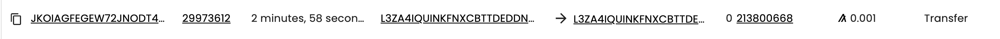

# SHMUP Unity Game with Algorand SDK

**Author:** Adrian Michael Ross

**Acknowledgements:**

* Russ Fusitino, Algorand Foundation Developer Advocate who served as a mentor and played a major part in this project.
* Professor Hank Korth, Lehigh University Professor who acted as advisor for this project.
* Justin Fletcher, Unity Developer and YouTuber for the Gradius-like Demo.
* Jason Bou Kheir, Community Developer and Algorand SDK for Unity author, who guided me through the SDK.
* Gabriel Coleman, Community Developer, who helped me getting started with Unity.
* Frank Szendzielarz, Community Developer, who wrote the Algorand .NET SDK, as well as the Visual Studio extension and aided me in working with both.

**Disclaimer:** I’m not affiliated with Unity. This project is not audited and should not be used in a production environment. The Unity demo is a modified version of a [youtube tutorial](https://www.youtube.com/watch?v=rH9IHdp1dyU&list=PL6ynPcXXvDY_9nYW_S-nAliA1w1mARm8x&pp=iAQB) by Justin Fletcher. I highly recommend checking out his channel to learn more about Unity and game development. Consider supporting him too!

## Abstract

This document is a tutorial that will walk you through the process of building a Unity SHMUP game that uses the Algorand SDK to reward players with ASA Game Tokens. It provides functionality to generate Algorand accounts, check supporting clients, retrieve asset metadata, and interact with assets. The script also includes some additional functionality related to the game, such as new UI and refreshed animations.

## Table of Contents

* [Requirements](#requirements)
* [Background](#background)
    - [The Potential of ASAs](#the-potential-of-asas)
    - [Scrolling SHMUP Game](#scrolling-shmup-game)
* [Steps](#steps)
    - [1. Setup Unity](#1-setup-unity)
    - [2. Setup Algorand Unity SDK](#2-setup-algorand-unity-sdk)
    - [3. Setup Game Assets](#3-setup-game-assets)
    - [4. Configuring Unity](#4-configuring-unity)
    - [5. Creating Game Tokens](#5-creating-game-tokens)
    - [6. Build the Algo UI (optional)](#6-build-the-algo-ui-optional)
    - [7. Starting the Algo.cs Script](#7-coding-the-algo.cs-script)
    - [8. Awake Method](#8-awake-method)
    - [9. Start Method](#9-start-method)
    - [10. Check Status Methods](#10-check-status-methods)
    - [11. Get Asset Method](#11-get-asset-method)
    - [12. Opting Into the Asset Method](#12-opting-into-the-asset-method)
    - [13. Sending the Asset Methods](#13-sending-the-asset-methods)
    - [14. Usage](#14-usage)
    - [15. Done!](#15-done)
    - [16. A Building Block to Much More](#16-a-building-block-to-much-more)


## Requirements

> Help on these requirements can be found in [Steps](#steps) from steps 1 to 4.

1. An IDE to code. Visual Studio for Windows is recommended because of its integration with Unity and other tools in the ecosystem (like [Algorand for Visual Studio](https://marketplace.visualstudio.com/items?itemName=FrankSzendzielarz.AlgoStudio) "AlgoStudio" extension which comes in handy for smart contracts). Visual Studio Code also works with Unity. It is what I used, but requires an extensive setup.
2. Unity Hub and Unity, in addition to a basic understanding of how to develop Unity projects.
3. Algorand SDK for Unity. This is a Unity package that allows you to interact with the Algorand blockchain from within Unity. It is a wrapper around the Algorand SDK for C#. It is now downloadable from the [Unity Asset Store](https://assetstore.unity.com/packages/decentralization/infrastructure/algorand-sdk-247704).
4. Indexer such as AlgoExplorer or DappFlow to see the transactions on the blockchain.
5. Docker - used in running a testnet node. This is optional, but recommended. You can also use a node from a third party provider like AlgoExplorer.

## Background

### The Potential of ASAs

NFTs have taken the last few years by storm. They are a way to represent ownership of digital assets. They are unique, non-interchangeable, and can be used to represent objects outside of a standard fungible token. However, recently the hype has stagnated due to a commonly held perception that they are nothing more than 2d variations of an ape. While this is one use case, NFTs have the potential to be so much more. They can be used to represent ownership of physical assets, like a house or a car. They can be used to represent ownership of other digital asset, like a video game item or a song. They facilitate asset transferring, enable fractional ownership, and enable other possibilities like ongoing royalty payments and automated rental agreement.

Algorand is the perfect blockchain to build these NFTs on. Not only is it a fast, secure, and scalable blockchain, but it has a built-in feature that makes it easy to create and manage NFTs. It is called Algorand Standard Assets (ASA), which provides a standardized, Layer-1 mechanism to represent any type of asset on the Algorand blockchain.

### Scrolling SHMUP Game

The game we will be building is a scrolling shoot-em-up (SHMUP) game. The player controls a spaceship that can move up and down and shoot blaster beams. The goal of the game is to shoot down as many enemy spaceships as possible without getting hit. The player has three lives, and the game ends when the player loses all three lives. The player can collect power ups to increase their firepower and score. Read more about what makes a good [SHMUP game](https://www.racketboy.com/retro/shmups-101-a-beginners-guide-to-2d-shooters).

All game assets and most of the Unity code was developed by Justin Fletcher. He has a step-by-step series that you can find [here](https://www.youtube.com/watch?v=rH9IHdp1dyU&list=PL6ynPcXXvDY_9nYW_S-nAliA1w1mARm8x&pp=iAQB).

This tutorial covers the building of a script using the Algorand SDK to reward players with ASA Game Tokens. The script is written in C# and is used in a Unity game to interact with the Algorand blockchain. It provides functionality to generate a new Algorand account, check the status of the Algod and Indexer clients, retrieve an asset from the blockchain, opt into the asset, and send the asset to another account. The script also includes some additional functionality related to the game, such as updating the balance and displaying it on the UI.

## Steps

### 1. Setup Unity

To get started, you need to have Unity installed.

#### Create with Unity in three steps

1. Download Unity Hub : https://unity.com/download/
2. Choose your Unity version (tutorial uses `2022.3.4f1`, but any of the latest should be compatible)
3. Start your (new) project
    1. Click the _'New project'_ blue button in the upper-right-hand corner
    2. From the template list, choose 2D Core and on the right panel, give your project a memorable name

### 2. Setup Algorand Unity SDK

You also need to have the **Algorand SDK** for Unity installed.

1. In the _Unity Hub_ sidebar go to the _Community_ menu and click _Unity Asset Store_ ... or just enter go to : https://assetstore.unity.com/
2. Search for **'Algorand SDK'** and freely "purchase" the asset or alternatively click this [link](https://assetstore.unity.com/packages/decentralization/infrastructure/algorand-sdk-247704)
3. Go back to _Unity Hub_ and open your project
4. Click the cloud icon in the left-hand corner of the editor
5. Click the _Packages : Unity Registry_ dropdown in the left-hand corner of the pop-up and go to _My Assets_
6. Refresh if needed with the button at the bottom of the sidebar in the pop-up
7. Click _Algorand SDK_ and choose _Download_
8. Once downloaded, choose _Import_ which should bring up a list of assets, with all selected confirm _Import_ again
9. You can confirm you followed the steps correctly if there is now an `Algorand.Unity` package under your `./Assets` folder in your _Project Window_

#### Algorand SDK Pre-release Versions

Alternatively, to access the source code or pre-release versions, you can download the package from the [GitHub repository](https://github.com/CareBoo/unity-algorand-sdk).

Once cloned or downloaded, in the Unity editor, navigate to Assets > Import Package > Custom Package and select the Algorand SDK for Unity package. Take a look at the [documentation](https://github.com/CareBoo/unity-algorand-sdk#readme) to see how to configure the scope.

### 3. Setup Game Assets

Next, we need to load the pre-made game assets and functionality to kickstart this tutorial and focus on the Algorand side of things.

1. Go to this tutorial's [repository](https://github.com/adrianmross/galagorand/). In the root of the directory click on `galagorand-game-assets.unitypackage` and download the package to somewhere accessible.


2. In the navbar go to _Assets > Import Package_ and click _Custom Package.._, and then navigate to your downloaded package


3. It will again bring a list of assets in the package, with all selected confirm _Import_

### 4. Configuring Unity

1. These steps are slightly tedious, but within the_ Project Window_ under `./Assets` you will find a folder `Scenes` containing 5 scene `.unity` files, one of which is a default `SampleScene` added to every new project and can be deleted


2. In the navbar go to _File > Build Settings.._ to open up the _Build Settings Menu_. It should look like `Figure5` below. We will be editing the 'Scenes in Build'. If you have not deleted the _SampleScene_, you can uncheck it now


3. Double click on each scene (besides the _SampleScene_) in `Assets/Scenes` to load the scene into the editor and then in the _Build Settings Menu_ click _Add Open Scenes_, repeating for each scene in this order
    * 0 - `MainMenu`
    * 1 - `Level1`
    * 2 - `Level2`
    * 3 - `Level3`

4. At this stage we should also set Visual Studios as the External Script Editor
    1. In the navbar go to 'Edit' > 'Preferences' which will open the Preferences Menu
    2. On the sidebar of the menu under 'Analysis' go to 'External Tools'
    3. At the top select Microsoft Visual Studio, which will be automatically recognized if installed on the machine you are working on

#### Visual Studio or Visual Studio Code for Unity

Unity uses the Mono runtime to run C# scripts. Mono is an open-source implementation of the .NET framework. Unity also provides a built-in code editor called MonoDevelop. However, it's recommended to use Visual Studio or Visual Studio Code for Unity development. To learn how to set up Visual Studio or Visual Studio Code for Unity development, check out the [documentation for VS](https://visualstudio.microsoft.com/vs/unity-tools/) or [VS Code](https://code.visualstudio.com/docs/other/unity).

### 5. Creating Game Tokens

In order for our players and demo to recieve tokens, we as the game creator need to create game tokens. 

1. With the Aglorand Unity SDK installed in our Unity project, we can follow this simple CreateASAs tutorial from the Algorand Unity SDK docs: https://careboo.github.io/unity-algorand-sdk/4.1/manual/algorand_standard_assets/creating_asas_in_editor.html
2. From this tutorial you can copy 2 addresses that you will need to proceed with the rest of the tutorial:
    1. The Index of your GameToken asset (your assetId)
    2. The Creator Account Address and Mnemonic (creator account)


### 6. Build the Algo UI (optional)

> If you imported the game assets from the repository, the AlgoUserInterface prefab is already made. However, to understand how, read below.

The best way to add the Algo script to your Unity project is to create a Game Object that is persistent throughout the game. My recommendation would be to use a UI element that gets updated throughout the game.

1. Create a prefab of a UI element that will be used to display the balance of the asset.
2. We first need a canvas to hold the UI elements. Right click in the hierarchy and select UI > Canvas.


3. Then right click on the canvas and select UI > Text. This will create a text element that will be used to display the balance. You can change the text to whatever you want, but make sure to keep the name as "BalanceText". You can also change the font, font size, and color.


### 7. Coding the Algo.cs Script

The full script can be found in the [GitHub repo]() in `source/Algo.cs`. The only components that needs to be changed are the `assetId` that you made in [Step 5](#5-creating-game-tokens) and `senderMnemonic` located in `SendAsset()`.

#### Dependencies

The script requires the following dependencies:

- Algorand.Unity: A library that provides Algorand blockchain integration for Unity.
- Algorand.Unity.Indexer: A library that provides Algorand indexer integration for Unity.
- System.Collections: A standard library for working with collections in C#.
- UnityEngine: The Unity engine library.
- Cysharp.Threading.Tasks: A library for asynchronous programming in C#.
- UnityEngine.UI: A library for working with UI elements in Unity.
- TMPro: A library for working with advanced Text GUI elements in Unity.

Based on all the prerequisites, you should be able to use all of these right away.

#### Vulnerabilities

The most serious flaw is the use of local account generation and storing mnemonic in PlayerPrefs. This is a temporary solution, and NOT secure and should only be used for testing as PlayerPrefs are not secure storage and all local account objects can be reverse engineered. The alternative approach would be to use WalletConnect sessions.

The most viable place to hold the asset creator's private key is on a game server. Therefore, the `SendAsset` method should send a request to the server to send the asset. The server should then create the transaction and send it to the Algorand blockchain.

We can further use a smart contract and by default have the ASA as frozen to manage the game token. This will allow us to create a leaderboard and other game logic. We can also use the smart contract to manage the game token and ensure that the game token is not sent to an account that is not a player.

##### Alternatives to a Game Server

A more  another option might be to use a service like [Azure Key Vault](https://developer.algorand.org/tutorials/create-an-algorand-node-on-microsoft-azure-and-sign-transaction-with-azure-key-vault/). This has to be looked at further

#### Class Structure

The `Algo` class extends the `MonoBehaviour` class, which is the base class for Unity scripts. It includes various fields, methods, and lifecycle callbacks to interact with the Algorand blockchain and handle game-related functionality.

A base Unity script has a `Start()` method that is called before the first frame update and an `Update()` method that is called once per frame. However, since we are using the indexer, we need to use asynchronous methods that perform outside of the main thread as may need to wait due to network calls. Therefore, we will be using the `Awake()` method to initialize the singleton instance and the `Start()` method to initialize the Algorand account and check the status of the Algod and Indexer clients. 

We will also be using the `Update()` method to check when the player finishes all the levels and call the `WrappedSendAsset()` method to initiate the process of sending the asset to another account. The `WrappedSendAsset()` method starts a coroutine named `waiter` that waits for 2 seconds before sending the asset. A coroutine is a function that can suspend its execution until the given yield instruction completes. This is to ensure that the asset is created before sending it.

As our opt in and send asset methods are asynchronous, we will be using the `async` and `await` keywords to make the methods asynchronous and wait for the response before proceeding. We will also be using the `UniTask` class to make the methods asynchronous. The `UniTask` class is a library that provides a unified task API for Unity. It is a wrapper around the `Task` class and provides a more efficient way to work with tasks in Unity.

#### Fields

- `instance`: A static field representing the singleton instance of the `Algo` class.
- `algod`: An instance of the `AlgodClient` class used for interacting with the Algod client.
- `indexer`: An instance of the `IndexerClient` class used for interacting with the Indexer client.
- `algodHealth`: A string representing the health status of the Algod client.
- `indexerHealth`: A string representing the health status of the Indexer client.
- `account`: An instance of the `Algorand.Unity.Account` class representing the Algorand account.
- `txnStatus`: A string representing the status of a transaction.
- `asset`: An instance of the `Asset` class representing an asset on the Algorand blockchain.
- `balance`: An integer representing the balance of the asset.
- `balanceText`: A `Text` component representing the UI element to display the balance.
- `connectionColor`: An `Image` component representing the color of the Connection button .
- `connectionText`: A `TextMeshProUGUI` component representing the UI element to display the connection status.
- `assetId`: An unsigned long representing the ID of the game token ASA (Algorand Standard Asset) on the testnet. **Update** this value with the asset ID of the game token ASA you created earlier.

### 8. Awake Method

`./Alog.cs`

```csharp
// Awake is called when the script instance is being loaded
    private void Awake()
    {
        if (instance == null)
        {
            instance = this;
            DontDestroyOnLoad(gameObject);

            balanceText = GameObject.Find("BalanceText").GetComponent<Text>();

            // connection
            connectionColor = GameObject.Find("ConnectionButton").GetComponent<Image>();
            connectionText = GameObject.Find("ConnectionText").GetComponent<TextMeshProUGUI>();
        }
        else
        {
            Destroy(gameObject);
        }
    }
```

 `Awake()`: This method is called when the script instance is being loaded. It initializes the singleton instance, sets the `balanceText` field by finding the corresponding UI element, and generates or retrieves the Algorand account based on whether the account mnemonic is stored in PlayerPrefs.

### 9. Start Method

`./Alog.cs`

```csharp
// Start is called before the first frame update
    void Start()
    {
    Debug.Log("Start");

        balanceText = GameObject.Find("BalanceText").GetComponent<Text>();

        // connection
        connectionColor = GameObject.Find("ConnectionButton").GetComponent<Image>();
        connectionText = GameObject.Find("ConnectionText").GetComponent<TextMeshProUGUI>();

        connectionColor.color = Color.red;
        connectionText.text = "NOT CONNECTED";

        // if account not connected, generate new account

        if (PlayerPrefs.GetString("users_local_mnemonic") == "")
        {
            Debug.Log("Generating new account"); 
            var (privateKey, address) = Algorand.Unity.Account.GenerateAccount();
            account = new Algorand.Unity.Account(privateKey);
            Debug.Log($"My address: {account.Address}");
            var mnemonic = privateKey.ToMnemonic();
            Debug.Log($"My mnemonic: {mnemonic}");
            UnityEngine.Application.OpenURL($"https://dispenser.testnet.aws.algodev.network/?account={account.Address}");
            PlayerPrefs.SetString("users_local_mnemonic", mnemonic.ToString());
            PlayerPrefs.Save(); // is this secure storage?

            // AssetAccept
            AcceptAsset().Forget();
        }
        else
        {
            Debug.Log("Account already exists");
            Mnemonic mn = Mnemonic.FromString(PlayerPrefs.GetString("users_local_mnemonic"));
            account = new Algorand.Unity.Account(mn.ToPrivateKey());
        }

        CheckAlgodStatus().Forget();
        CheckIndexerStatus().Forget();

        WrappedConnection();
    }
```

`Start()`: This method is called before the first frame update. It initializes the `algod` client, checks the status of the Algod and Indexer clients, and performs asset acceptance if a new account is generated.

### 10. Check Status Methods

`./Alog.cs`

```csharp
public void WrappedConnection()
    {
        try
        {
            GetAsset().Forget();
        }
        finally 
        {
        StartCoroutine(getConnection());
        }
    }

    IEnumerator getConnection()
    {
        yield return new WaitForSeconds(2);
        try
        {
            CheckAlgodStatus().Forget();
            CheckIndexerStatus().Forget();

            connectionColor.color = new Color(0.3f, 0.85f, 0.3f, 1f);
            connectionText.text = "CONNECTED";
        }
        catch
        {
            connectionColor.color = Color.red;
            connectionText.text = "NOT CONNECTED";
        }
        
    }
```

`WrappedConnection()` and `getConnection()` show the user if they are connected or not every 2 seconds.

```csharp
// Check the status of the algod client
    public async UniTaskVoid CheckAlgodStatus()
    {
        var response = await algod.HealthCheck();
        if (response.Error) algodHealth = response.Error;
        else algodHealth = "Connected";
    }
```

`CheckAlgodStatus()`: This method asynchronously checks the status of the Algod client and updates the `algodHealth` field accordingly.

```csharp
// Check the status of the indexer client
    public async UniTaskVoid CheckIndexerStatus()
    {
        var response = await indexer.MakeHealthCheck();
        if (response.Error) indexerHealth = response.Error;
        else indexerHealth = "Connected";
    }
```

`CheckIndexerStatus()`: This method asynchronously checks the status of the Indexer client and updates the `indexerHealth` field accordingly.

### 11. Get Asset Method

`./Alog.cs`

```csharp
// Get the asset
    public async UniTaskVoid GetAsset()
    {
        var apiResponse = await indexer.LookupAssetByID(assetId);
        if (apiResponse.Error) Debug.LogError(apiResponse.Error);
        else {
            Debug.Log("Successfully retrieved asset");
            Debug.Log($"Asset: {apiResponse.GetText()}");
            AssetResponse assetResponse = apiResponse.Payload;
            asset = assetResponse.Asset;
        }
        Debug.Log($"Asset: {asset.Params.Creator.ToString()}");
    }
```

`GetAsset()`: This method asynchronously retrieves the asset from the Algorand blockchain using the `indexer` client and updates the `asset` field.

Since we are using the indexer we need to `await` the response. The indexer is a separate service that indexes the blockchain and provides a fast and efficient way to query the blockchain. Therefore all calls to the indexer are asynchronous and cannot be run in the `Start()` method.

### 12. Opting Into the Asset Method

Before we can send the asset to another account, we need to opt into the asset by sending a transaction to the Algorand blockchain. This is done by calling the `AssetAccept` method on the `Algorand.Unity.Account` instance.

`./Alog.cs`

```csharp
// Opt into the asset
    public async UniTaskVoid AcceptAsset()
    {
        var opter = $"{account.Address}";
        var algod = new AlgodClient("https://node.testnet.algoexplorerapi.io");
        var (txnParamsError, txnParams) = await algod.TransactionParams();
        if (txnParamsError)
        {
            Debug.LogError(txnParamsError);
            txnStatus = $"error: {txnParamsError}";
            return;
        }
        var xferAsset = assetId;
        var optinTxn = Algorand.Unity.Transaction.AssetAccept(opter, txnParams: txnParams, xferAsset);
        var signedTxn = account.SignTxn(optinTxn);

        // Send the transaction
        var (sendTxnError, txid) = await algod.SendTransaction(signedTxn);
        if (sendTxnError)
        {
            Debug.LogError(sendTxnError);
            txnStatus = $"error: {sendTxnError}";
            return;
        }
        else
        {
            Debug.Log("Sender Account = " + account.Address);
            Debug.Log("Transaction sent, TxID = " + txid.TxId.ToString());
        }

        // Wait for the transaction to be confirmed
        var (confirmErr, confirmed) = await algod.WaitForConfirmation(txid.TxId);
        if (confirmErr)
        {
            Debug.LogError(confirmErr);
            txnStatus = $"error: {confirmErr}";
            return;
        }
    }
```

`AcceptAsset()`: This method asynchronously opts into the asset by sending a transaction to the Algorand blockchain.


When the code is run, the following transaction can be seen on the Algorand testnet:



### 13. Sending the Asset Methods

The principal method for sending the asset to another account is the `SendAsset` method.

`./Alog.cs`

```csharp
// Send the asset to the user
    public async UniTaskVoid SendAsset(string receiver, Address sender, ulong amount)
    {
        // make sender account from mnemonic
        Mnemonic senderMnemonic = Mnemonic.FromString("..."); // REPLACE ... with saved Mnemonic of creator
        Algorand.Unity.Account senderAccount = new Algorand.Unity.Account(senderMnemonic.ToPrivateKey());

        var algod = new AlgodClient("https://node.testnet.algoexplorerapi.io");
        var (txnParamsError, txnParams) = await algod.TransactionParams();
        if (txnParamsError)
        {
            Debug.LogError(txnParamsError);
            txnStatus = $"error: {txnParamsError}";
            return;
        }
        var xferAsset = assetId;

        var xferTxn = Algorand.Unity.Transaction.AssetTransfer(sender,txnParams, xferAsset, amount, receiver);
        var signedTxn = senderAccount.SignTxn(xferTxn);

        // Send the transaction
        var (sendTxnError, txid) = await algod.SendTransaction(signedTxn);
        if (sendTxnError)
        {
            Debug.LogError(sendTxnError);
            txnStatus = $"error: {sendTxnError}";
            return;
        }
        else
        {
            Debug.Log("Sender Account = " + account.Address);
            Debug.Log("Transaction sent, TxID = " + txid.TxId.ToString());
        }

        // Wait for the transaction to be confirmed
        var (confirmErr, confirmed) = await algod.WaitForConfirmation(txid.TxId);
        if (confirmErr)
        {
            Debug.LogError(confirmErr);
            txnStatus = $"error: {confirmErr}";
            return;
        }

        // update balance
        balance += (int)amount;
        balanceText.text = balance.ToString();
    }
```

`SendAsset(string receiver, Address sender, ulong amount)`: This method asynchronously sends the asset to the specified receiver by creating and sending a transaction to the Algorand blockchain. It also updates the balance and the `balanceText` UI element

You then need to call this method from the `waiter` coroutine so that the asset is first indexed before sending.

```csharp
// Waiter is used to wait for 2 seconds before sending the asset, this is to ensure that the asset is created before sending
    IEnumerator waiter()
    {
        GetAsset().Forget();
        //Wait for 2 seconds
        yield return new WaitForSeconds(1);
        
        Address assetCreator = asset.Params.Creator;
        ulong assetAmount = ulong.Parse(asset.Params.Total.ToString());

        Debug.Log($"Asset amount: {assetAmount}");
        // reward amount, can be changed and based on game logic
        ulong rewardAmount = 10;
        if (assetAmount - rewardAmount < 0)
        {
            Debug.Log("Not enough ASA to send");
        }
        // send asa to user, this is a temporary solution, and NOT secure and should only be used for testing. a game server is the only place to hold the private key and therefore this operation should send a request to the server to send the asset
        else
        SendAsset(account.Address, assetCreator, 10).Forget();
    }
```

`waiter()`: This coroutine is used to wait for 2 seconds before sending the asset. It retrieves the asset and then waits for the specified time before calling the `SendAsset` method.

`WrappedSendAsset()` is called to initiate the process of sending the asset to another account. It starts a coroutine named `waiter` and is called from the `Update()` method in `Level.cs` when the player finishes all the levels.

When the code is run, the following transaction can be seen on the Algorand testnet:


### 14. Usage

To use this script, follow these steps:

1. Import the required dependencies (`Algorand.Unity`, `Algorand.Unity.Indexer`, `System.Collections`, `UnityEngine`, `Cysharp.Threading.Tasks`, and `UnityEngine.UI`) into your Unity project.
2. Attach the `Algo` script to a GameObject in your scene
    1. Open the prefab `./Assets/AlgorandUserInterface` and in the _Inspector_ click _Add Component_

    

    2. Search up `Algo` and click on it
3. Make sure you have a UI element with the name "BalanceText" to display the balance.
4. Ensure that you have a valid Algorand node URL and indexer URL specified in the code (replace the placeholders with the correct URLs).
5. Call the appropriate methods from other scripts or UI buttons to interact with the Algorand blockchain (e.g., `WrappedSendAsset()` to initiate the asset transfer process).
6. Customize the code as per your specific requirements and integrate it into your game logic.

Please note that this documentation provides a general overview of the script's functionality. It's recommended to have a good understanding of Algorand blockchain integration and Unity development before using this script in a production environment.

> Need a refresher on Algorand blockchain integration? Here is a [playlist](https://www.youtube.com/@algodevs/playlists) for you.

### 15. Done!

You can use the Unity editor to run the game. You can also build the game for Windows, Mac, or Linux. To do this, go to _File > Build Settings_, select the platform you want to build for, and click _Build_. This will create a build in the specified folder. You can even run a test run by just clicking the _Play Button_ in the Unity Editor. View the debug logs in the console to see the status of the Algorand client and the transactions.

### 16. A Building Block to Much More
Some ideas that you can implement to improve this demo and make an even more complex game ready for production:

* Add a wallet to the game so that players can see their balance and send the ASA to other accounts.
* Add a leaderboard to the game so that players can see the top players using a smart contract.
* Add a game server to the game so the private key of the transaction is not stored on the client side.
* Refactor. This is just one solution, but it’s definitely not the best solution. Improve it or write a better solution!

> Have a look at all other Algorand Microsoft Technology tools [here](https://developer.algorand.org/articles/algorand-microsoft-developer-tools/)!

**Finished Unity Demo repo:** https://github.com/adrianmross/galagorand

If you found this tutorial interesting or helpful and want to see more please leave a star!